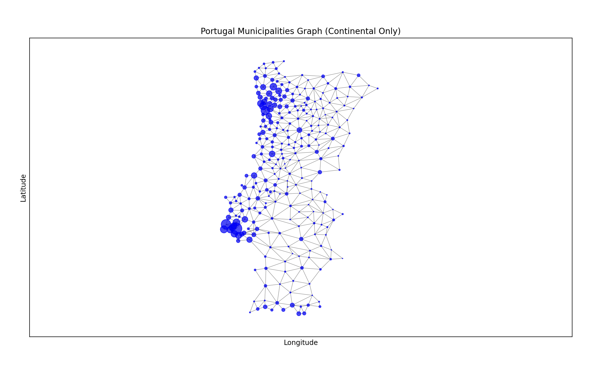

# Portugal Municipalities Graph Visualization

## Overview
This project visualizes the municipalities (concelhos) of Portugal using a graph structure. Each node represents a concelho, and the edges represent connections based on geographical distances. Node sizes are proportional to the population of each municipality.

## Preview

## Features
- Fetches municipality data from a .zip file.
- Visualizes the graph using NetworkX and Matplotlib.
- Node sizes are dynamically scaled based on the population.
- Option to show or hide node labels.

## Installation
To run this project, make sure you have Python 3.x installed. You will also need the following libraries:
- `networkx`
- `matplotlib`
- `numpy`
- `requests`
- `geopandas`

## Data Sources
- CAOP, provided by @pedrofp4444
- Municipalities' population fetched from [wikipedia](https://pt.wikipedia.org/wiki/Lista_de_munic%C3%ADpios_de_Portugal)
